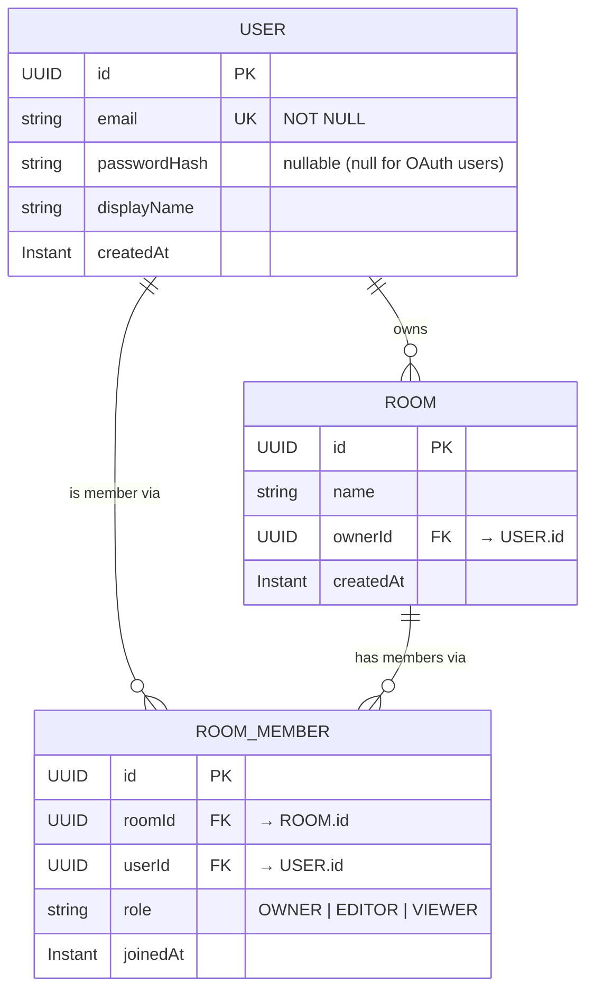

# Phase 1: Spring Boot Foundation — Iteration Plan

> **Goal:** Establish the Feature-Sliced package skeleton, define core JPA entities, build auth and room REST endpoints with Spring Security, and cover everything with integration tests.

---

## Iteration 1 — Package Skeleton & Database Connection

**Objective:** Get the project compiling cleanly with the correct package structure and a working database connection.

### Tasks

- [x] Create the top-level feature packages under `com.collab.api`:
  ```
  auth/
  user/
  room/
  shared/
    config/
    exception/
    security/
  ```
- [x] Add `application.yaml` datasource config for local PostgreSQL (via `compose.yaml` which is already present).
- [x] Add Flyway or Liquibase for schema migrations — **do not rely on `spring.jpa.hibernate.ddl-auto=create`** in any environment beyond a throwaway local run.
  - Recommended: **Flyway** (`spring-boot-starter-data-jpa` pulls it in automatically when on classpath).
  - First migration file: `V1__create_initial_schema.sql`.
- [ ] Verify the app starts and connects to the DB: `./mvnw spring-boot:run`.

### Spring Concepts

| Concept | ASP.NET Core Equivalent |
|---|---|
| `application.yaml` datasource block | `appsettings.json` connection strings |
| `spring.jpa.hibernate.ddl-auto` | EF Core `Migrate()` / `EnsureCreated()` |
| Flyway migrations in `resources/db/migration/` | EF Core migration files |
| `compose.yaml` (Spring Boot Docker Compose integration) | Auto-spins up Postgres container on `./mvnw spring-boot:run` — no manual `docker compose up` needed in dev |

---

## Iteration 2 — Core JPA Entities

**Objective:** Define the three foundational entities and their relationships.

### Entity Relationship Diagram



### Tasks

- [x] Create `user/User.java` — JPA entity with:
  - `id` (`UUID`, generated)
  - `email` (unique, not null)
  - `passwordHash` (nullable — null for OAuth users added in Phase 3)
  - `displayName`
  - `createdAt` (`Instant`, `@CreationTimestamp`)

- [x] Create `room/entity/Room.java`:
  - `id` (`UUID`, generated)
  - `name`
  - `ownerId` (FK → `users.id`)
  - `createdAt`

- [x] Create `room/entity/RoomMember.java` (join table with extra columns):
  - Composite or surrogate PK
  - `roomId` + `userId` (unique constraint)
  - `role` (`enum`: `OWNER`, `EDITOR`, `VIEWER`) — store as `@Enumerated(EnumType.STRING)`
  - `joinedAt`

- [x] Add `UserRepository.java` in `user/`.
- [x] Add `RoomRepository.java` and `RoomMemberRepository.java` in `room/`.
- [x] Add Flyway migration `V1__create_initial_schema.sql` that creates `users`, `rooms`, and `room_members` tables.

### Spring Concepts

| Concept | ASP.NET Core Equivalent |
|---|---|
| `@Entity` + `@Table` | EF Core model class + `[Table]` attribute |
| `@Id` + `@GeneratedValue` | `[Key]` + value generator in EF Core |
| `@Column(nullable = false, unique = true)` | `[Required]` + `HasIndex().IsUnique()` in Fluent API |
| `@Enumerated(EnumType.STRING)` | `HasConversion<string>()` on enum property |
| `@CreationTimestamp` (Hibernate) | `SaveChangesInterceptor` or value generator |
| `JpaRepository<T, ID>` | `DbSet<T>` with built-in CRUD — `findById`, `save`, `delete`, `findAll` are free |

> **Note:** Prefer `UUID` over `Long` as a primary key type. It avoids enumerable IDs in URLs and aligns with how the Yjs room IDs are already handled on the Node side.

---

## Iteration 3 — Centralized Error Handling

**Objective:** Establish a consistent API error shape before writing any endpoint, so every controller inherits it automatically.

### Tasks

- [x] Create `shared/exception/ApiException.java` — a `RuntimeException` subclass carrying an HTTP status and a message.
- [x] Create `shared/exception/ErrorResponse.java` — a record/DTO that defines the JSON error body:
  ```json
  { "status": 400, "error": "BAD_REQUEST", "message": "Email already in use" }
  ```
- [x] Create `shared/exception/GlobalExceptionHandler.java` annotated with `@RestControllerAdvice`:
  - Handle `ApiException` → return its status + `ErrorResponse`.
  - Handle `MethodArgumentNotValidException` (Bean Validation failures) → return `400` with field-level errors.
  - Handle generic `Exception` → return `500` without leaking stack traces.

### Spring Concepts

| Concept | ASP.NET Core Equivalent |
|---|---|
| `@RestControllerAdvice` | Global exception middleware / `IProblemDetailsWriter` |
| `@ExceptionHandler(SomeException.class)` | `catch (SomeException)` block in middleware |
| `MethodArgumentNotValidException` | `ModelState.IsValid` / `ValidationProblemDetails` |
| `ResponseEntity<T>` | `ActionResult<T>` / `IResult` |

---

## Iteration 4 — Spring Security Baseline

**Objective:** Configure Spring Security so it does not block all requests by default during development, but lays the foundation for JWT in Phase 2.

### Tasks

- [x] Create `shared/config/SecurityConfig.java` annotated with `@Configuration` + `@EnableWebSecurity`.
- [x] Define a `SecurityFilterChain` bean that:
  - Disables CSRF (stateless REST API — same as ASP.NET Core `services.AddCors()` + `[ApiController]` pattern).
  - Sets session management to `STATELESS`.
  - Permits `POST /auth/register` and `POST /auth/login` publicly.
  - Requires authentication on all other routes.
- [x] Register a `BCryptPasswordEncoder` bean (`@Bean` in `SecurityConfig` or a dedicated `shared/config/AppConfig.java`).

### Spring Concepts

| Concept | ASP.NET Core Equivalent |
|---|---|
| `SecurityFilterChain` bean | `app.UseAuthentication()` + `app.UseAuthorization()` pipeline |
| `.csrf(AbstractHttpConfigurer::disable)` | `services.AddAntiforgery()` disabled for APIs |
| `.sessionManagement(s -> s.sessionCreationPolicy(STATELESS))` | JWT bearer scheme (no cookie session) |
| `.authorizeHttpRequests(...)` | `[Authorize]` / `[AllowAnonymous]` attributes |
| `BCryptPasswordEncoder` bean | `services.AddSingleton<IPasswordHasher<T>>()` |

> **Important:** In Phase 2, the JWT filter (`OncePerRequestFilter`) will be inserted into this chain via `.addFilterBefore(jwtFilter, UsernamePasswordAuthenticationFilter.class)`. Keeping `SecurityConfig` clean and additive now avoids rewriting it later.

---

## Iteration 5 — Auth Endpoints

**Objective:** Implement user registration and login. Return a temporary session token (plain UUID stored in DB) that will be replaced by a proper JWT in Phase 2.

### Tasks

- [x] Create `auth/dto/RegisterRequest.java` — `email`, `password`, `displayName` with `@NotBlank` / `@Email` Bean Validation annotations.
- [x] Create `auth/dto/LoginRequest.java` — `email`, `password`.
- [x] Create `auth/dto/AuthResponse.java` — `token`, `userId`, `displayName`.
- [x] Create `auth/AuthService.java`:
  - `register(RegisterRequest)`: check email uniqueness → hash password → save `User` → return token.
  - `login(LoginRequest)`: load user by email → verify BCrypt hash → return token.
  - Publish `UserRegisteredEvent` after successful registration (even if no listener exists yet — adds no overhead and keeps the service decoupled from the start).
- [x] Create `auth/AuthController.java`:
  - `POST /api/auth/register` → `201 Created` + `AuthResponse`
  - `POST /api/auth/login` → `200 OK` + `AuthResponse`
- [x] Create `auth/event/UserRegisteredEvent.java` — a Java `record` with `userId` and `email`.

### Spring Concepts

| Concept | ASP.NET Core Equivalent |
|---|---|
| `@Valid` on `@RequestBody` param | `[FromBody]` with model validation |
| `@RequestBody` | `[FromBody]` |
| `@PostMapping("/register")` | `[HttpPost("register")]` |
| `ResponseEntity.status(201).body(...)` | `Created(...)` / `StatusCode(201, ...)` |
| `ApplicationEventPublisher.publishEvent(...)` | `IPublisher.Publish(...)` (MediatR) |

---

## Iteration 6 — Room Endpoints

**Objective:** Basic room CRUD protected by the auth guard.

### Tasks

- [x] Create `room/dto/CreateRoomRequest.java` — `name` with `@NotBlank`.
- [x] Create `room/dto/RoomResponse.java` — `id`, `name`, `ownerId`, `createdAt`.
- [x] Create `room/RoomService.java`:
  - `createRoom(String name, UUID ownerId)`: save room → add owner as `RoomMember` with role `OWNER` → return `RoomResponse`.
  - `getRoomsForUser(UUID userId)`: return rooms where the user is a member.
  - `getRoomById(UUID roomId, UUID requesterId)`: return room or throw `ApiException(404)` if not found / not a member.
- [x] Create `room/RoomController.java`:
  - `POST /api/rooms` → `201 Created` + `RoomResponse`
  - `GET /api/rooms` → `200 OK` + list of `RoomResponse`
  - `GET /api/rooms/{id}` → `200 OK` + `RoomResponse`

### Obtaining the Authenticated User

In Phase 2, JWTs will carry the `userId`. For Phase 1 (session token), extract the user from the `SecurityContext`:
```java
// In controller — Spring populates this from the SecurityContext
@GetMapping
public List<RoomResponse> listRooms(Authentication authentication) {
    UUID userId = UUID.fromString(authentication.getName());
    return roomService.getRoomsForUser(userId);
}
```

---

## Iteration 7 — Integration Tests

**Objective:** Verify each endpoint behaves correctly without a running server (slice tests).

### Tasks

- [x] Add `@SpringBootTest` + `@AutoConfigureMockMvc` integration test class: `auth/AuthControllerTest.java`.
  - Happy path: `POST /api/auth/register` → `201` + token in body.
  - Duplicate email: `POST /api/auth/register` → `409 Conflict`.
  - Invalid payload: `POST /api/auth/register` with missing `email` → `400` + field error.
  - Login with wrong password → `401`.
- [x] Add `room/RoomControllerTest.java`:
  - Create room as authenticated user → `201`.
  - List rooms → only returns rooms the user is a member of.
  - Unauthenticated request → `401`.

### Spring Testing Concepts

| Concept | ASP.NET Core Equivalent |
|---|---|
| `@SpringBootTest(webEnvironment = MOCK)` | `WebApplicationFactory<T>` |
| `MockMvc` | `HttpClient` from test factory |
| `@AutoConfigureMockMvc` | Configures `MockMvc` automatically |
| `mockMvc.perform(post("/api/auth/register").contentType(APPLICATION_JSON).content(json))` | `client.PostAsJsonAsync(...)` |
| `@Sql("/sql/reset.sql")` before each test | `context.Database.EnsureDeleted()` + re-seed |
| `@Transactional` on test class | Auto-rollback after each test (careful: hides commit-dependent side effects) |

> **Tip:** Use `@Sql` with a cleanup script or `@Transactional` to ensure tests are isolated. Shared mutable DB state between tests causes flaky results.

---

## Definition of Done for Phase 1

- [ ] App starts cleanly and connects to Postgres via `compose.yaml`.
- [ ] Flyway migration runs on startup with no errors.
- [ ] `POST /api/auth/register` and `POST /api/auth/login` return tokens.
- [ ] Room endpoints return `401` for unauthenticated requests and `201`/`200` for authenticated ones.
- [ ] `GlobalExceptionHandler` returns consistent `ErrorResponse` JSON for all error cases.
- [ ] All integration tests pass (`./mvnw test`).
- [ ] No business logic inside controllers — controllers only validate input, call a service, and map the result to a `ResponseEntity`.
